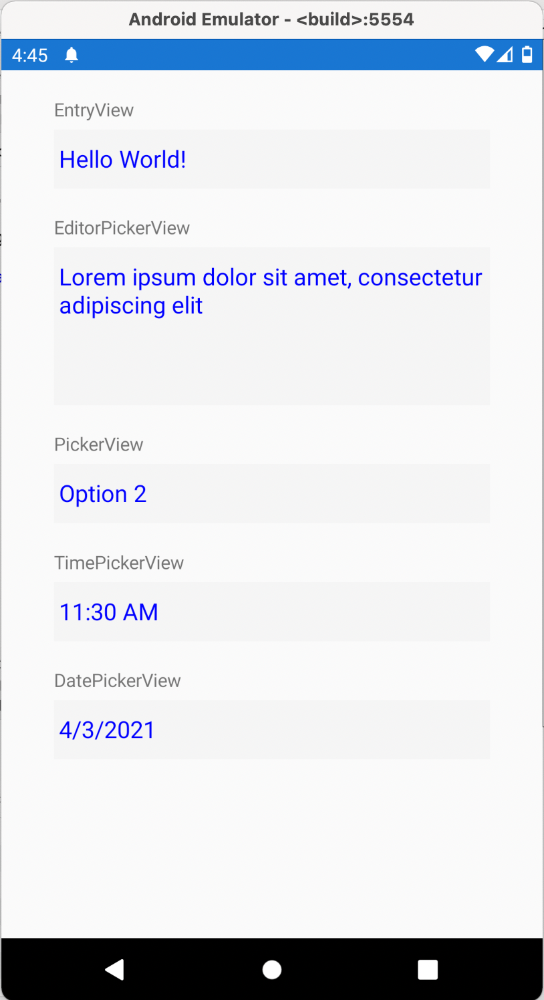

<p align="center">
  
</p>

# Xamarin.Forms.Plainer
This library removes all visual effects from controls and makes them easy to style from portable layer instead of writing custom renderers always.
No underlines, no borders, no background colors. Just interactive fields without visual effect.

<hr />

[](https://www.codefactor.io/repository/github/enisn/xamarin.forms.plainer)
[](https://www.nuget.org/packages/Xamarin.Forms.Plainer/)

## Set-up

- Install `Xamarin.Forms.Plainer` to each platform

- Add Initialize method into platforms

  - **Android**: Go to `MainActivity` and add following:

    ```csharp
    protected override void OnCreate(Bundle savedInstanceState)
    {
      base.OnCreate(savedInstanceState);
    
      global::Xamarin.Forms.Forms.Init(this, savedInstanceState);
    
      // Add follwoing line
      global::Plugin.Plainer.Platforms.Droid.Plainer.Init(this, savedInstanceState); // <--
    
      LoadApplication(new App());
    }
    ```

  - **iOS**: Go to `AppDelegate  ` and add following line:

    ```csharp
    public override bool FinishedLaunching(UIApplication app, NSDictionary options)
    {
      global::Xamarin.Forms.Forms.Init();
    
      // Add following line
      global::Plugin.Plainer.Platforms.iOS.Plainer.Init(); // <--
    
      LoadApplication(new App());
    
      return base.FinishedLaunching(app, options);
    }
    ```


## Usage

- Go your XAML page and add following namespace:

  `xmlns:plain="clr-namespace:Plugin.Plainer.Shared.Controls;assembly=Plugin.Plainer"`

- And you can start to use plain controls:

  ```xml
  <plain:EntryView/>
  ```

  This will be completely invisible, that's the point of plainer. Just try a rounded corner to input:

  ```xml
  <Frame BorderColor="Blue" CornerRadius="20" Padding="5">
    <plain:EntryView TextColor="Blue"/>
  </Frame>
  ```

  Result will be:

  <table>
    <tr>
      <td>
      	
      </td>
      <td>
        
      </td>
    </tr>
  </table>


## Showcase

<table>
  <tr>
    <td>
    	
    </td>
    <td>
      
    </td>
  </tr>
</table>


You can create this view vith following code:

```xml
<StackLayout Spacing="20" Padding="40,20">
  <StackLayout>
    <Label Text="EntryView"/>
    <controls:EntryView TextColor="Blue" BackgroundColor="WhiteSmoke"/>
  </StackLayout>

  <StackLayout>
    <Label Text="EditorPickerView"/>
    <controls:EditorView HeightRequest="120" TextColor="Blue" BackgroundColor="WhiteSmoke"/>
  </StackLayout>

  <StackLayout>
    <Label Text="PickerView"/>
    <controls:PickerView TextColor="Blue" BackgroundColor="WhiteSmoke">
      <controls:PickerView.ItemsSource>
        <x:Array Type="{x:Type x:String}">
          <x:String>Option 1</x:String>
          <x:String>Option 2</x:String>
          <x:String>Option 3</x:String>
        </x:Array>
      </controls:PickerView.ItemsSource>
    </controls:PickerView>
  </StackLayout>

  <StackLayout>
    <Label Text="TimePickerView"/>
    <controls:TimePickerView TextColor="Blue" BackgroundColor="WhiteSmoke"/>
  </StackLayout>

  <StackLayout>
    <Label Text="DatePickerView"/>
    <controls:DatePickerView TextColor="Blue" BackgroundColor="WhiteSmoke"/>
  </StackLayout>

</StackLayout>
```

